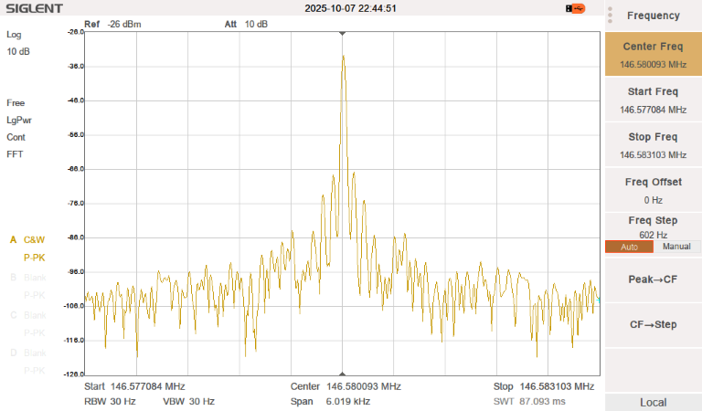
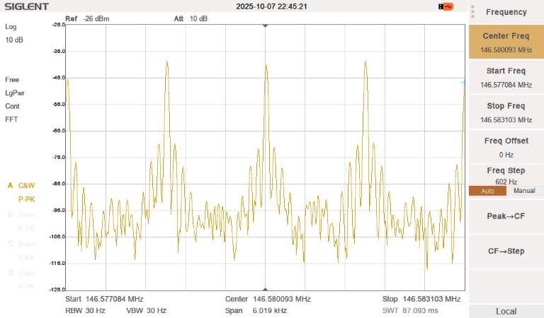
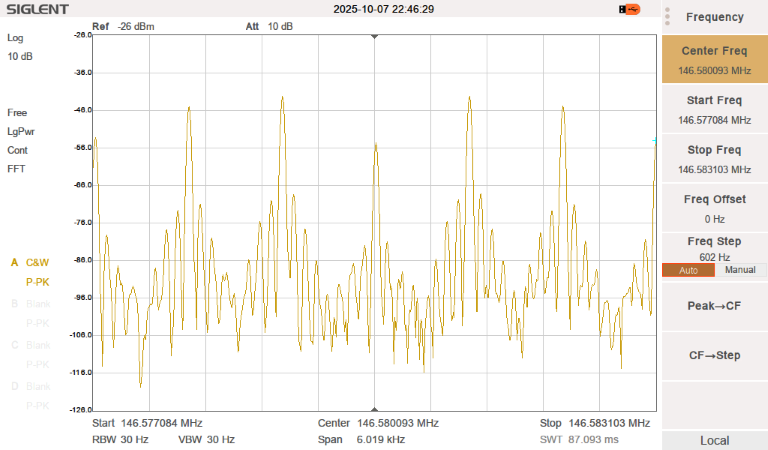
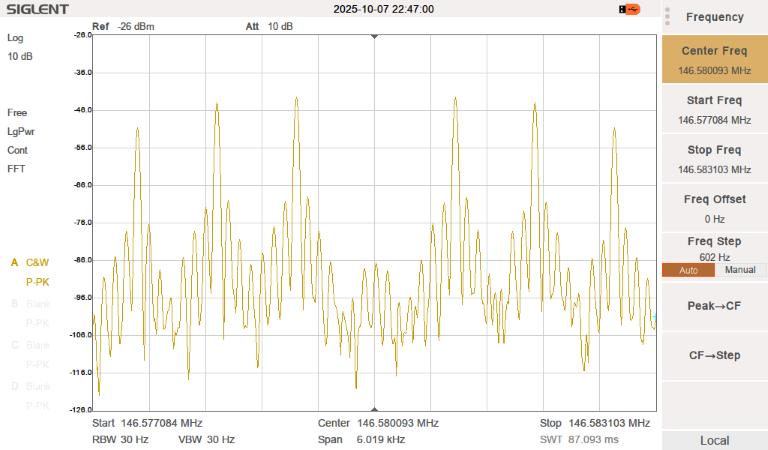

_Copyright (C) Bruce MacKinnon, 2025.  Contact info at bottom of the page for comments/corrections._

I've been experimenting with this module. The datasheets are lacking a bit. Here 
are my notes.

The module has a power range of 3.3 to 5.5V (Vdd). When powered from a +5V
supply the logic I/Os including TXD, RXD, PTT, and AFSQ all operate using
3.3V logic. So there is no level-shifting required to communicate with 
the module from a 3.3V controller.

# Audio Input

A 10mVpp signal generator (HiZ) at 1 kHz gives a good tone on a receiver.

# FM Deviation Measurement

Here we use the Bessel null method to evaluate the deviation of the module.

Module is keyed with no audio input and the carrier is centered. 

Tone magnitude is set to 30mVpp and frequency to 1.5kHz. We see the expected sidebands appear:

Tone frequency is reduced to 1.0kHz. We see the carrier start to diminish relative to the sidebands.

Frequency is adjusted until the carrier is at the noise floor, about 850 Hz:

Since the carrier's first null will happen with a modulation index of 2.4, we can compute the deviation:

        Δf = deviation • modulation_frequency

So the deviation is 2,040 Hz.

# Programming/Commands

[Programming Guide](https://www.qsl.net/ta2ei/devreler/sa818/SA818%20programming%20manual.pdf)

IMPORTANT: The characters that make up a command (including the trailing CR/LF)
need to be sent in one batch. There is obviously some kind of internal timeout
that generates an error state if there is any delay between characters.
So **connecting a terminal emulator and typing commands
interactively into the module (at human speed) won't work.**

The examples in the programming guide notwithstanding, the frequencies must be
specified with 4 digits to the right of the decimal point.

AT+VERSION
AT+DMOCONNECT
# NOAA receiver
AT+DMOSETGROUP=0,162.4750,162.4750,0000,1,0000
AT+DMOSETGROUP=0,146.5800,146.5800,0000,1,0000
# CTCSS tone=88.5 on transmit and receive
AT+DMOSETGROUP=0,146.5800,146.5800,0008,1,0008
AT+DMOSETVOLUME=4
# Query for RSSI
RSSI?

