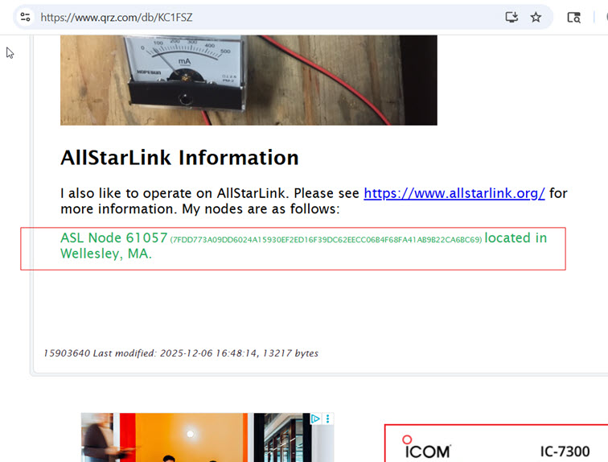
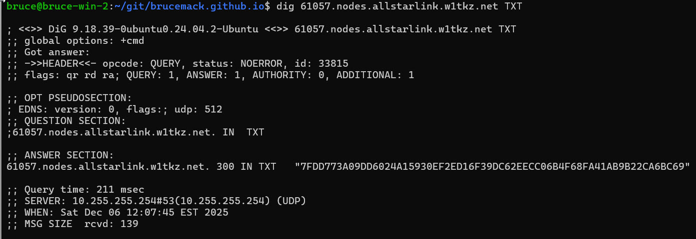

This structure combines the suggestion for how to do IP-address-independent
authentication from Jason N8EI and the use of [www.qrz.com](https://www.qrz.com/) as a 
ham authenticator from David Gleason NR9V.

None of this has been endorsed by the ASL system, this is just a brainstorm 
of how a next-generation authentication system might work. I'm just a random 
ham/homebrewer ([KC1FSZ](https://www.qrz.com/db/KC1FSZ)) tinkering in this space. 

## One-Time Setup For Each New ASL Node

* The user creates their own 32-byte secret seed and saves it somewhere safe. This is 
a 32 octets, or a 64 character hex string. ED25519 would be a good choice. One example 
of a place to create a
seed is here: https://cyphr.me/ed25519_tool/ed.html. www.allstarlink.org might 
also have a page for doing this.
* The user uses their new secret seed to create a public key using an online tool, or 
www.allstarlink.org.
* The user looks at the public list of AllStarLink nodes and chooses their own node 
number following the official AllStarLink guidelines (i.e. can't start with a 3, 
must be a number in a certain range, etc.).  Obviously, they shouldn't choose a number
that is already used. This is very similar in concept to the 
[SLACC](https://datatracker.ietf.org/doc/html/rfc4862) mechanism in IPv6.
* The user goes to their QRZ biography page and adds a note about their AllStarLink node that 
includes their node number and public key 
follows this format:

        ASL Node 61057 (7FDD773A09DD6024A15930EF2ED16F39DC62EECC06B4F68FA41AB9B22CA6BC69) located in Wellesley, MA.

The visual format (i.e. fonts and colors) doesn't matter, so long as the text is structured
this way. It looks like this:

* The user goes to the www.allstarlink.org portal to a new page called "Refresh My Node 
List," enters their call sign, and presses "Refresh."
* The ASL portal reaches out to the appropriate page on QRZ (https://www.qrz.com/db/KC1FSZ
in my case) and pulls the text of the page, extracting the ASL node numbers and public 
keys. This is a one-time-per-setup operation, *the QRZ page is not used on an ongoing/operational
basis to validate ASL connections*.
* The ASL portal checks its existing records:
  - A black-list is enforced.
  - For any node that has never been seen before it is registered as "taken" with the user's 
    callsign and a DNS TXT record is created at nnnnn.nodes.allstarlink.org with the public key provided.
  - For any node that is already taken by the user the DNS TXT record is updated with the new
    public key.
  - For any node that is already taken by ANOTHER user (i.e. a collision) the portal displays an 
    error message and rejects the request.
* At this point the public key of the node is registered in DNS under nnnn.nodes.allstarlink.org. That looks like this (disregard the w1tkz.net part):

## Ongoing Node Registration

As today, nodes on the network periodically post their public-facing IP address
and port number into register.allstarlink.org. 

* Every 10 minutes each live node signs the IP address/port combination using the node's 
private key and posts it to register.allstarlink.org. 
* The ASL registration server uses the node's public key to validate the signature. 
* The ASL registration server checks the request against a black-list.
* If valid, the registration server updates the relevant SVR and A records in DNS to allow
other users to find the node via queries to _udp._iax.nnnnn.nodes.allstarlink.org and nnnnn.nodes.allstarlink.org. IMPORTANTLY: This registration uses the IP address/port provided by the registree in the body of their 
registration message *without regard for the source address that the registration message originated
from*. The trust has been established using the public/private key pair - not by the source IP 
address (which can change because of the vagaries of CGNAT, etc.).

The process described above would be available as an alternative to the existing system.
Compatibility with the current IP-based registration system would be maintained.

## Making a Connection to a Node

This is very straight-forward mutual PKI validation. 

* The caller node uses DNS to find the IP address/port of the called node.
* The caller node connects to the called node, creates a nonce, and sends it in an AUTHREQ challenge
to the called node. 
* The called node signs the nonce with its private key and sends the signature back in an AUTHREP
response.
* The caller node validates the signature returned node using the called node's public key
found in DNS. 
* Similarly, the called node creates a nonce and sends it to the caller node in an AUTHREQ challenge.
* The caller node signs the nonce with its private key and sends the signature back in an AUTHREP
response.
* The called node validates the signature returned by the calling node using the calling node's public 
key found in DNS.

At this point both sides trust each other and the call can proceed. 

## Advantages

* None of the authentication mechanisms depend on IP addresses. A station can register 
any address/port combination it wants to. This will eliminate many CGNAT-related headaches
for hams who operate their stations behind firewalls or at repeater sites with mobile/cellular
hotspots.
* Modern public-key authentication is used. No more passwords.
* The process of deciding whether a user is a licensed ham has been delegated to QRZ.com. I would
guess that most people have already gone through the QRZ.com setup process?
* The ASL team doesn't need to administer node numbers. Users pick their own numbers (from a 
range designated by the ASL team). This is very similar to IPv6 SLACC. The ASL system only 
needs to prevent collisions. 
* No special user interface portal needs to be developed for the maintenance of ASL node 
registrations. Users just need to be instructed how to format their QRZ bio page.
* The ASL system doesn't need to hold secrets in the database. Users hold their own secrets.
* The ASL server concept goes a way. Each node registers its own address/port.
* The HTTP registration API doesn't require HTTPS for security. This makes life easier for 
developers of embedded platforms that might not have full-fledged TLS stacks available.

## Disadvantages

* Some education will be required. Some hams might not be comfortable with PKI concepts
and may not be comfortable managing their own keys.
* Development would be required to support this. The ASL services would need to be added
and the app_rpt would need to be modified to take advantage of the new capabilities.
* If the selected PKI mechanism becomes mathematically compromised in the future the 
entire system would become insecure.

## Practicalities

* The existing ASL registration system/portal would need to stay up to support the existing nodes.
* Perhaps new servers/nodes would be required to use the new system?
* Pulls from QRZ would need to be governed to avoid creating measurable load on their system.
An ASL user should be limited to a few "QRZ biography page pulls" a day.
* ED25519 would be a good PKI choice given that the public keys are short and DNS-friendly.
* QRZ already has a more structured database where users can store details like their 
GEO location, DXpedition details, QSL contacts, etc. Perhaps they would be willing to expand
this to included structured information about ASL/EchoLink node numbers, public keys, etc.?