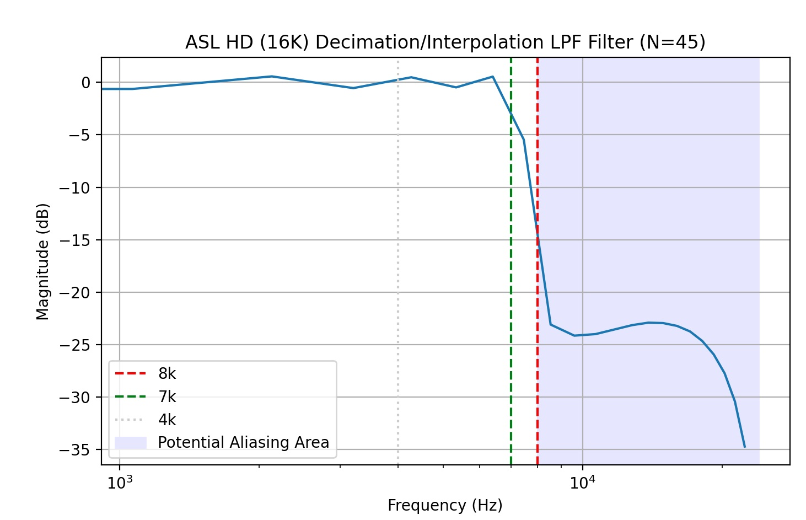
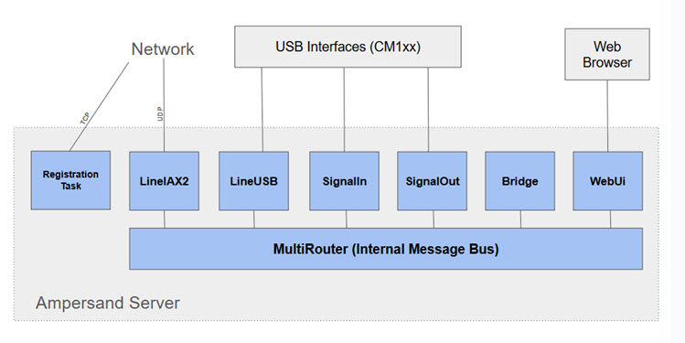
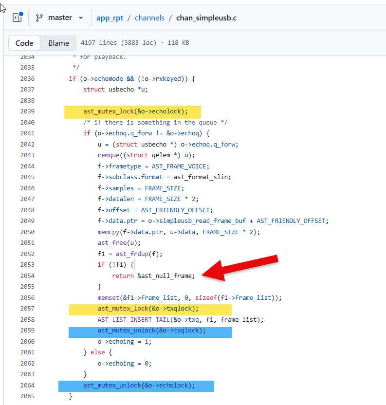
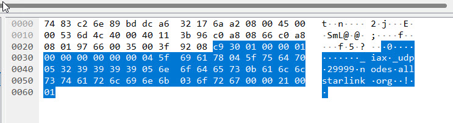
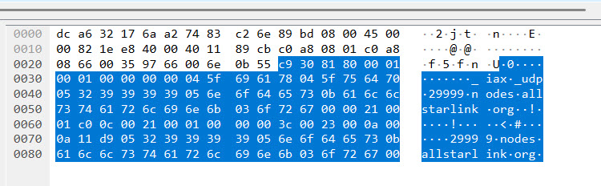
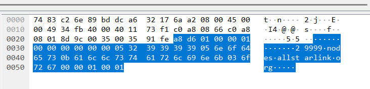
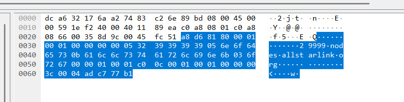
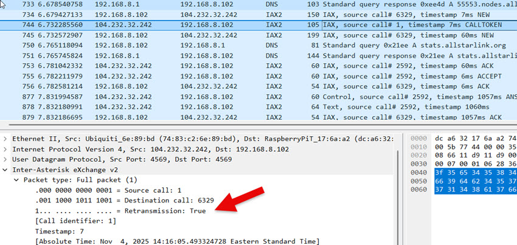

The purposes of this project:
* To provide hams with a simple way to link radios to 
the [AllStarLink](https://www.allstarlink.org) network. Radio-less applications are also supported (conference
hubs, direct audio connections, etc.). 
* To provide a platform for research and experimentation to advance the state-of-the-art
around ham radio linking. 
* To maintain compatibility with the rest of the ASL ecosystem. This **is not** a fork
of ASL or an attempt to create a parallel network.

This project was originated in October of 2025 by [Bruce MacKinnon (KC1FSZ)](https://www.qrz.com/db/KC1FSZ)
of the [Wellesley Amateur Radio Society](https://ema.arrl.org/wellesley-amateur-radio-society/) in Wellesley, MA. Please reach out using the e-mail address provided in QRZ. You can try me on AllStar 
node 672730, as long as I'm not in the middle of a compile. [I'm also on LinkedIn](https://www.linkedin.com/in/bruce-mackinnon-7256314/).

The [original thread where this was introduced is located here](https://community.allstarlink.org/t/a-minimal-asl-node-without-asterisk-dependency-r-d/23879).

I'm not an expert on VOIP or ASL. I just got into this in 
late 2025. 

The [GitHub project is here](https://github.com/Ampersand-ASL).

# Table of Contents

* (Will be replaced with table of contents)
{:toc}

# Introduction

There are well established ways to get on AllStarLink using the [ASL3](https://allstarlink.github.io/) package and
the [Asterisk](https://www.asterisk.org/) open-source PBX. Asterisk is a sophisticated system intended
for a broad set of telephony applications. As such, it can be hard to understand, hard to configure, and hard to enhance. The Ampersand project is 
focused on supporting a **minimal set of capabilities needed by hams.**

The Ampersand project is not attempting to replace Asterisk. There are 1000's of 
successful Asterisk installations being used by hams and that isn't expected to change.
My hope is that Ampersand will provide a better platform for experimental work.

# Users/Installation Guide

Please see [The Ampersand Server User's Guide](https://github.com/Ampersand-ASL/amp-server/blob/main/docs/user.md) for installation instructions.

# Conceptual Model of the Ampersand Server

_(Work in process, diagram needed)_

This section describes the conceptual model of the Ampersand 
Server. Ampersand enables integration with the AllStarLink network (abbreviated ASL). For the purposes of this description, 
we define ASL as the following:

* A namespace that assigns a unique identifier
for each node on the ASL network.
* A robust process for issuing node numbers that tracks
ownership, prevents 
duplicates and ensures that only licensed amateurs are allowed on the network.
* The [documented IAX2 protocol](https://datatracker.ietf.org/doc/html/rfc5456), which allows ASL servers to communicate
with each other across public/private IP networks.
* The AllStarLink registration service that provides:
  - The ability to resolve a node number to a network address
  using documented APIs and/or DNS.
  - A secure way to allow a node owner to update the network 
  address of their node using documented APIs.
* The AllStarLink monitoring service which provides:
  - The ability to view/query status information for 
  any node on the ASL network using defined APIs or
  through a sophisticated web portal.
  - The ability for nodes to periodically post their status
  using defined APIs. 
* Some "parrots," and other special-purpose nodes that 
provide the diagnostic/support capabilities necessary for a robust network.
* A [community forum](https://community.allstarlink.org/) used
to make announcements and discuss the ASL network.
* The [ability to collect donations](https://www.allstarlink.org/about/donate.php) necessary to support the infrastructure
for this large network.

Strictly speaking, the Asterisk PBX server is _just one 
implementation_ of the IAX2 protocol, but it is not a 
required component of
the ASL network. Any network participant who is a licensed 
ham, [makes their donation](https://www.allstarlink.org/about/donate.php) to support the infrastructure, and follows all of the 
protocols described above can communicate.

The Ampersand **server** is a process that runs on a network-connected
computer or microcontroller. A server can host one or more **nodes**,
where the term "node" has the usual meaning on the ASL network.

Nodes are connected to one another via **links**. Nodes that 
are linked pass audio and signaling information between each
other. If multiple nodes are linked to the same node, those
nodes are all in conference with each other. With a few exceptions,
audio transmitted into a node will be received by all other 
linked nodes and vice-versa.

Two nodes hosted by the same server are not necessarily linked.

The Ampersand server hosts one or more **lines**. A line is
the medium that allows audio/signaling information to 
be passed into and out of a node. At the moment,
there are two types of lines supported by Ampersand:
* An IAX2 line, which provides the connectivity between
nodes across a network.
* A USB line, which allows a node to be connected to 
a USB interface (typically a radio or other audio device).

(Call)
(Users)
(Permanent Link)

# Technical Information

This section contains various articles on different parts of the ASL system. Some of this is 
more detail that a normal user would need, but the goal is to encourage understanding/experimentation
with the mechanics of VOIP linking system.

## Audio/DSP 

The Ampersand audio "core" runs at 48kHz. Audio is down/up-sampled when interfacing with links
that operate at lower bandwidths. 

I've done some analysis of the Asterisk/app_rpt DSP functions which
is [documented here](asl-dsp-notes.md). I've not followed the 
app_rpt model in all cases, but this is very good background 
to have.

### Audio Level Measurement in the ASL System

[Please see this article](asl-audio-levels.md) for more information.

### 16K Audio (aka "ASL-HD")

The existing app_rpt/chan_simpleusb code appears to make the fundamental assumption that network 
audio is sampled at 8kHz. The USB side of the system runs at a higher rate (48K), but the
captured stream is immediately down-converted to 8K. It's possible that this restriction is 
inherited from the Asterisk architecture somewhere, although I doubt it because the Asterisk PBX has 
some 16K CODECs. 

The Ampersand system avoids this limitation. The system supports a 16K audio mode that we're 
calling "ASL-HD." This may not be relevant for links between typical analog repeaters that 
operate with narrow
audio bandwidths, but "pure digital" links (i.e. desktop-to-desktop) sound much better in 16K.

Since the Ampersand audio core runs at 48K, a decimation/interpolation low-pass filter is needed during the 
down/up sampling process. I've used a 45-tap FIR filter designed using [the Parks-McClellan algorithm](https://github.com/brucemack/firpm-py).

The ideal cut-off frequency of this filter should be at 8kHz, but there is a transition band. I've 
started the transition at 7kHz. Here's the transfer function of the filter used in the system:

{: width="400" }

This looks decently flat in the passband, rolls off steeply, and attenuates anything that could create aliases.

Ampersand's 16K CODEC is just 16-bit linear PCM represented in little-endian format. According to the official 
[IANA Registry for IAX](https://www.iana.org/assignments/iax-parameters/iax-parameters.xhtml) there
is no CODEC media code allocated for 16K PCM. However, the Wireshark dissector for IAX2 lists CODEC
code 0x00008000 as 16K linear PCM. Since the IANA registry doesn't provide an assignment for this 
particular code (i.e. it's "open") I'm assuming that's the right one to use. (I'll put that 
on the list of things to ask IANA to update in their documentation.)

Ampersand will favor 16K linear PCM whenever possible, falling back to G.711 uLaw (8K) as needed.

### 16K Linear "HD" Media Format Registration

An IAX2 media format needs to be defined to allow nodes to negotiate this
format during call setup. 

There is no official Media Format listed for 16K linear audio in the current 
version of the IAX2 RFC. I raised the question about the best way to represent the 16K linear media format in the IAX2 protocol on the Asterisk development forum. Someone pointed me to an older Asterisk header file that showed that media format 0x00008000 had been allocated to 16K 16-bit linear, little endian format. The same file also explicitly stated that media format 0x00000040 is for 8K linear. That shows that the IAX2 RFC is out of date. I’ve raised a request with the IANA people to have the RFC revised with this additional information. More to follow.

## Jitter Buffer

The "jitter buffer" is the subject of a lot of discussion on the AllStarLink board over the 
years. After studying this quite a bit, I can now appreciate the challenge of making this 
work efficiently. I’ve been focused on adaptive algorithms that do a good job of keeping the 
latency through the system as short as possible. The method I’ve settled on at the moment is 
called "Ramjee Algorithm 1" after a paper by Ramjee, Kurose, Towsley, and Schulzrinne called 
"Adaptive Playout Mechanisms for Packetized Audio Applications in Wide-Area Networks". Unfortunately, 
the paper is behind an IEEE paywall so I can’t link to a copy of it. This algorithm estimates 
the variance of the flight times of the voice packets and dynamically adjusts the size of the 
jitter buffer to be larger for very jittery transmissions and smaller for less jittery ones. It 
works pretty well at keeping the delay as short as possible. 

Simple adaptive jitter buffer algorithms wait until the end of a transmission before making an 
adjustment to the delay. That’s usually OK, but there are times when the variance is spiking up and 
the adaptive algorithm would really like to extend the delay a bit to increase margin and avoid 
voice packet loss. Fancy VoIP systems have the ability to “slow down” a few frames of audio 
mid-stream to allow the delay to be extended without creating an audible gap in the conversation. This 
is closely related to PLC - more below.

It’s hard to tell exactly how the jitter buffer inside of Asterisk works, but I don’t think it’s using any very advanced adaptive algorithms.

### Notes on EchoLink Jitter Buffer

I asked Jonathan K1RFD, the author of EchoLink, what his software does. Here's a 
section of his reply:

> Bruce,
> 
> I don't recall all of the details, but here's what I do remember:
> 
> The app looks at the sequence number of packets and is on the lookout for any gaps in the 
> numbering, or out-of-sequence packets.
>
> If packets which are still in the buffer are out of sequence, they are re-arranged so as to be 
> properly consecutive.
>
> If a gap in the numbering is detected, and the buffer is nearly empty, a packet of silence is 
> inserted to take the place of the missing packet.
> 
> One thing to be on the lookout for is non-consecutive numbering coming from conference servers. Some 
> conference servers might pass along the original sequence numbers from each participant, rather than
> generating their own new ones, and if so, this will create a big discontinuity in between 
> transmissions. But, by that time, the buffer is probably already empty due to the pause between
> transmissions.

### Jitter Buffer References

* [A paper that talks about skew (clock speed differences)](https://csperkins.org/publications/2000/07/icme2000/icme2000.pdf) from University College, London.
* [A paper: "Assessing the quality of VoIP transmission affected by playout buffer scheme"](https://arrow.tudublin.ie/cgi/viewcontent.cgi?article=1037&context=commcon)
* Paper: https://web.stanford.edu/~bgirod/pdfs/LiangMM2003.pdf
* A [good/detailed reference paper](https://vocal.com/voip/jitter-buffer-for-voice-over-ip/) written 
by VoCAL, a professional services firm in the VOIP space.
* Mentioned in the VOCAL reference: "The key element is the PWSOLA box (Packet-based Waveform Similarity Overlap-Add) which controls the adaptive buffer operation."
* [ALSA PCM timestamp stuff](https://docs.kernel.org/sound/designs/timestamping.html)
* [A journal article about statistical management of jitter](https://www.embedded.com/reducing-voip-quality-degradation-when-network-conditions-are-unstable/)

## Packet Loss Concealment (PLC)

Packet Loss Concealment (PLC) algorithms are one of the tricky parts of this system. PLC is the thing that fills gaps in a transmission that result from lost or, more commonly, very late voice packets. There are a lot of research papers on this topic. At the moment Ampersand is using something called “ITU G.711 Appendix I” which is a pretty standard/simple method. From looking at the waveforms that come out of Asterisk during packet loss, I am pretty sure it uses something very similar.

It’s confusing because G.711 usually refers to the uLaw/ALaw CODECs, but G.711 Appendix I has nothing to do with these CODECs. This PLC method could be used for any CODEC. [The paper is in the public domain](https://www.itu.int/rec/dologin_pub.asp?lang=e&id=T-REC-G.711-199909-I!AppI!PDF-E&type=items).

The idea is to estimate the “pitch” of a short recent sample of the transmission and then generate a synthetic sound (more than just a tone) that matches that pitch during any gaps in the transmission. The
G.711 algorithm "searches" for the best pitch by correlating recent history of the audio with a range 
of time-lagged versions of itself. Interestingly, the search range is limited to 66.66 Hz to 200 Hz, 
so the pitch estimation that comes out of this process is fairly low.

There are a bunch of features in this spectral interpolation algorithm that try to smooth the transitions between real speech and synthetic speech to avoid discontinuities. The result is surprisingly effective as long as the gap is small <= 60ms. And it runs well on a small microcontroller. Unsurprisingly, a lot of the cutting edge work in this space is focused on AI-driven models that predict longer passages of missing audio. It won’t be long before it can finish our sentences ...

The implementation of the G.711 approach can be found [in this Github repo](https://github.com/brucemack/itu-g711-codec).

### PLC Using WSOLA

(Docs to follow)

## Kerchunk Filtering

I love the [East Coast Reflector](https://www.eastcoastreflector.com/), but there’s a fair amount of kerchunking 
being reflected. This is to be expected given the large number of repeaters
connected on the network. I'm sure the other big networks have exactly the same
problem. It would be nice to have a way to filter out this kind of 
activity. 

I know the ASL `rxondelay=` helps to avoid false COS triggers and may eliminate some 
quick kerchunks, but I 
think that parameter 
serves a different purpose. It's basically a de-bounce on the COS line. A long 
setting for `rxondelay=` also 
has the undesirable effect of cutting off the beginning of a transmission.

Also, listening on the ECR, I suspect that a lot of the kerchunks 
are coming in on the various bridges to other digital modes (DMR, D-STAR, etc.)
and the physical COS pin debouncing is irrelevant in those cases.

I've been working on a more sophisticated kerchunk filter (KF). I have a new
module in the Ampersand audio pipeline that watches all of the audio frames that go 
by. If a transmission
starts after an extended period of silence (let's assume 1 minute, but configurable) 
the new audio frames are queued internally and are not passed forward in the pipeline.  If the transmission ends quickly (let's assume <2 seconds, but configurable) those queued
frames are discarded under the assumption that it's a kerchunk or some other transient. If the transmission lasts longer than 2s then it is considered to be legit and the queue starts playing out, with 2s of latency of course. Once the KF queue is drained it is bypassed and all subsequent audio is passed right through until another extended silence occurs. So basically, you are 2s behind only until that first spurt has been played out, and then no more delay. Hopefully it's clear that none of the audio was lost, it was just
delayed initially to make sure it passed the not-a-kerchunk test.

I could make this really fancy and use WSOLA to slightly speed up the playout, but I don't think that's necessary because the latency is reclaimed immediately on the next break in the QSO.

The 2s period was picked so that we don't lose quick/legit transmissions. _"KC1FSZ mobile, listening."_ 

I've also found that applying a voice activity detect (VAD) at the very start 
of a new transmission can allow an initial period of silence or near-silence
to be discarded so it doesn't count against the 2s 
anti-kerchunk 
timer. For example, if someone keyed up but remained silent for 15 seconds
that should still be considered a kerchunk for our purposes. 

After some experimentation with the heuristics, I've found the key is to make 
the KF aggressive after long periods of silence 
and then very accommodating once a new transmission becomes "trusted." 

During testing I adjusted the system so that it recorded all of the discarded 
audio into a single, concatenated .WAV file. This allows a quick review of what 
the system has classified as "kerchunk." [You can listen to one test file here](assets/kerchunk-capture.wav) that was created during 6 hours from the ECR during 
morning time EST. You can hear all sorts of strange sounds that were discarded. To 
my ear, I can only hear one thing in this test file (towards the end) that sounded like
a fragment of voice audio.

The best place for this capability is in the radio input path so that it can stop kerchunks 
from getting into the ASL system in the first place. But what is interesting is 
that you can put this same module into the network audio path. So basically
it can eliminate incoming network kerchunks if desired.

## Hamlib Tunnel for Remote Base

(Docs to follow)

## IAX2 Extensions

### Voice-Level Station ID

(Docs to follow)

# Software Architecture

The system is written in C++. I think this is a big step-up from C, but may still 
be considered a legacy language by many. C++ was originally invented
at Bell Laboratories for telecom applications so it's nice to use the language as 
it was originally intended. :-)

The source code for the system is developed in [this set of Github repos](https://github.com/Ampersand-ASL). The main branch is production/stable. Development activity is 
integrated on the develop branch.

I accept PRs to the develop branch.

## Software License

Ampersand is released under the [GNU Public License](https://www.gnu.org/licenses/gpl-3.0.en.html). 

## Software Structure - Repos

The code is divided into a few repos:

* [amp-core](https://github.com/Ampersand-ASL/amp-core) contains most of
the code, but doesn't build any executables. See below. Some parts of this
code are able to built on a microcontroller platform.
* [amp-server](https://github.com/Ampersand-ASL/amp-server) contains the 
code required to build the Ampersand Server on LINUX.
* [amp-hub](https://github.com/Ampersand-ASL/amp-hub) contains the 
code required to build the Ampersand Hub on LINUX. This would be used for "virtual" 
or cloud nodes with no connection to radio hardware.
* [asl-parrot](https://github.com/Ampersand-ASL/asl-parrot) contains the 
code required to build the ASL parrot server (LINUX).
* [amp-win](https://github.com/Ampersand-ASL/amp-server) contains the 
code required to build the Ampersand Server on Windows. (WORK IN PROCESS)

The code depends on some external/3rd-party repos that are referenced as GIT 
submodules. 

* [kc1fsz-tools-cpp](https://github.com/brucemack/kc1fsz-tools-cpp). A generic
C++ tools library used across many KC1FSZ projects.
* [kc1fsz-sdrc](https://github.com/brucemack/kc1fsz-sdrc) A software-defined
repeater controller (SDRC) project. This project pre-dates the Ampersand project.
* [The ITU G711 CODEC](https://github.com/brucemack/itu-g711-codec). Contains 
the G711 CODEC and G711 PLC code.
* [CMSIS DSP Mock Library](https://github.com/brucemack/cmsis-dsp-mock). A 
"mock" (i.e. simple, not-optimized) implementation of some of the important 
functions defined in the ARM CMSIS DSP library to improve portability of 
code targeting an ARM microcontroller onto "normal" platforms.
* [Craig McQueen's COBS Implementation](https://github.com/cmcqueen/cobs-c) A
nice C implementation of the Consistent Overhead Byte-Stuffing algorithm.
This is used when communicating with the SDRC platform.
* [An Implementation of ED25519](https://github.com/orlp/ed25519). Used for PKI.
* [A C++ HTTP Server Library](https://github.com/yhirose/cpp-httplib). Provides
a fully embedded HTTP server.

## Software Structure - High Level Diagram

This is a high-level diagram of the major software components:



* RegistrationTask - Runs the background and performs an ASL registration 
(via HTTPS call) every 12 minutes.
* LineIAX2 - Implements the IAX2 protocol.
* LineUSB - Interface to the USB audio interface.
* SignalIn - Interface to the USB HID interface needed for COS/CTCSS signals. Also
integrates with GPIO pins if needed.
* SignalOut - Interface to the USB HID interface needed for the PTT signal. Also
integrates with GPIO pins if needed.
* Bridge - Provides audio conference capability.
* WebUi - Provides an HTTP interface for a simple browser-based user interface.
There is no separate HTTP server, this uses a [a C++ HTTP Server Library](https://github.com/yhirose/cpp-httplib) to avoid the need for deploying separate processes.
* MultiRouter - An internal publish/subscribe bus for routing messages between
components in the server.

## Software Structure - Tracing the Audio Flow

One good way to explain the structure of the Ampersand code is to describe the 
detailed steps involved in taking a packet of IAX audio from the network and 
converting it to USB sound. 

Keep in mind
that each frame contains exactly 20ms of audio, so this entire flow happens 
about 50 time per second, regardless of the audio sampling rate.

Everything described below happens on a single processing thread under 
the control of the `EventLoop` class.

**Phase 0 - Happening Continuously**

* The main processing thread is looping in a class called `EventLoop`. 
You can see that towards the bottom of `main()` in the `main.cpp` file 
of the amp-server project.
* The `EventLoop` is keeping track of timers and monitoring for activity
on file descriptors.

**Phase 1 - Driven By IAX2 Packet Arrival**

* Everything starts with UDP (IAX2) frames on the network. `LineIAX2` class
is listening on a UDP socket and will receive the voice frame. At startup
`LineIAX2` has told `EventLoop` about the socket file descriptors it cares
about, so when UDP data arrives `EventLoop` will dispatch the `LineIAX2::run2()`
function.
* Function `LineIAX2::_processInboundIAXData()` is where the actual call 
to the socket `recvfrom()` happens. Keep 
in mind that the arrival of these frames is asynchronous and may not 
be perfectly spaced.
* The frame is examined to determine which call it belongs to. The frame is
forwarded to the correct instance of the `LineIAX2::Call` class for call-level 
processing. See `LineIAX2::_processFullFrameInCall()` or `LineIAX2::_processMiniFrame()` depending on whether the voice frame is full or mini.
* The voice frame is made into an instance of the `Message` class and is then 
put onto an internal message-passing bus. The bus is implemented by the `MultiRouter`
class.
* The server contains a conference bridge which is the central core of the system.
This is where all audio is collected, combined, and re-distributed. The conference bridge is implemented by the `Bridge` class.
* The `MultiRouter` forwards the `Message` containing the voice frame to the 
conference bridge (see the `Bridge::consume()` method).
* The `Bridge` looks at the `Message` and finds the appropriate instance of
the `BridgeCall` class. There is a `BridgeCall` for each active participant in the
conference, including the physical radios. See `BridgeCall::consume()`.
* The `BridgeCall` has a component responsible for call-level inbound audio called `BridgeIn`. The `Message` is passed to the `BridgeIn` class (see `BridgeIn::consume()`).
* `BridgeIn` implements a pipeline. First, the `Message` is 
passed to the jitter buffer implemented by the `SequencingBufferStd` class. 
See `SequencingBufferStd::consume()`.
* The `Message` is stored in the jitter buffer until it is selected for playout
in phase 2a.
* That's the end of phase 1. The system becomes idle at this point.

**Phase 2a - Driven by the 20ms Audio Clock**

* The `EventLoop` is maintaining a set of timers. 
* Every 20ms the `Bridge` class wakes up and tries to produce an audio frame
for each conference participant.
* Here we pick up with the next steps on the `BridgeIn` audio pipeline.
* The first step is to prompt the jitter buffers in each `BridgeCall` to 
play out a frame. The `SequencingBufferStd` wakes up and decides which is the next
`Message` to be played based on `Message` timestamps, latency calculations, etc. See `SequencingBufferStd::playOut()` for this complicated process.
* Once the `Message` emerges from the jitter buffer it is transcoded from its
network encoding to a 16-bit signed PCM format of the same sample rate. So, for example,
if the network encoding is G.711 it is transcoded to 16-bit PCM at 8kHz.
* The PCM audio is then passed through the packet-loss concealment (PLC) step which 
is implemented by the `Plc` class from the [`itu-g711-codec` repo](https://github.com/brucemack/itu-g711-codec). This is where interpolation is performed to smooth 
over any gaps in the audio stream.
* The output of the PLC step is still 16-bit PCM audio. The next step is to resample
that audio up to 48K.
* The 48K audio is packaged into a new `Message` instance and is passed into the 
Kerchunk Filter (KF) implemented by the `KerchunkFilter` class (see `KerchunkFilter::consume()`). Here some analysis/filtering
is performed to decide if the audio frame should be dropped, or at least delayed
to reduce the impact of spurious kerchunks.
* One the KF is complete the `Message` containing the 48K audio frame is **staged** 
at the end of the `BridgeIn` pipeline.
* That's the end of phase 2a. 

**Phase 2b - Driven by the 20ms Audio Clock**

* Every 20ms the `Bridge` class wakes up and produces a 48K audio frame that 
represent the "mix" of all conference participants who where talking during 
that 20ms tick. 
* The `Bridge` loops through all of the active `BridgeCall`s, determines 
which have audio to contribute, and calls `BridgeCall::extractInputAudio()` 
for each to pull the staged frame for the current tick, scaling appropriately based 
on the number of active speakers.
* The `Bridge` then provides the mixed audio for that tick to each 
conference participant by calling `BridgeCall::setOutputAudio()`.
* The `BridgeCall` has a component responsible for handling output audio
pipeline called `BridgeOut.` The `BridgeCall` passes the mixed frame to the
`BridgeOut` using `BridgeOut::consume()`.
* `BridgeOut` resamples the 48K audio to the rate required to support the 
CODEC used by the output conference participant. For example, if the 
participant is using the 16K SLIN CODEC the audio frame is resampled from 
48K down to 16K.
* `BridgeOut` then transcodes the PCM audio into the CODEC format used
by the conference participant. This audio is packaged into a new instance 
of the `Message` class.
* The encoded `Message` audio is passed into the message bus `MultiRouter.`
See `MultiRouter::consume()`.
* This is the end of phase 2b.

**Phase 2c - Driven by the 20ms Audio Clock**

(The description of this phase is unique to the USB radio interface.)

* The `MultiRouter` examines the `Message` created in phase 2b and 
dispatches it to the appropriate listener. This will be an instance of 
the `LineUSB` class in this case. See `LineUSB::consume()`.
* `LineUSB` makes heavy use of its base class `LineRadio` since much of
the code related to radio interfaces can be shared between USB and non-USB
cases. The `Message` is passed to `LineRadio::consume` for processing.
* `LineRadio::consume()` does some analysis of the audio frame to keep 
statistical information (peak, power levels, etc.) up to date. It then
calls back down to `LineUSB::_playPCM48k()`
* `LineUSB::_playPCM48k()` accumulates the 20ms audio frame into a circular
buffer that can hold about 60ms of audio. This buffer is called `LineUSB::_playAccumulator`. Some margin is required here because the USB
sound driver/hardware is operating asynchronously from the rest of the system
and may get slightly ahead/behind based on its own internal timing.
* This ends phase 2c.

**Phase 3 - Driven by the Availability of USB Play Buffer Space**

(The description of this phase is unique to the USB radio interface.)

* The `EventLoop` object is constantly checking to see if the USB 
play buffer is reporting that it has room. If so, the steps in this
phase are executed. The exact timing of this process is not known 
because the USB hardware interface operates somewhat asynchronously from 
the rest of this system.
* `LineUSB::_playIfPossible()` is called. The contents of the `LineUSB::_playAccumulator` are pushed into the USB play buffer. A return 
code is examined to determine how much audio was actually accepted. The amount 
of audio that will be accepted is not known in advance because the USB
hardware is operating asynchronously. Whatever audio is accepted into the
USB play buffer is removed from the `LineUSB::_playAccumulator`.
* This ends phase 3. The audio frame should be heard.

## A Few Notes on Project Software Philosophy

This is a C++ project. However, you'll note that there are no deep/complex
inheritance hierarchies. Also, the use of templates/meta-programming is kept 
to a minimum. Abstract interfaces ([GoF Facade Pattern](https://en.wikipedia.org/wiki/Facade_pattern)) are used as much as possible.

Linkages between the major components is kept as loose as possible. This is particularly
relevant in an application like this that deals heavily with networking. Most 
of the interaction between major components of the AMP Server are achieved through 
an asynchronous Message-passing interface.

The use of multi-threading is kept to an absolute minimum. There are two reasons for
this. First, I want to be able to run large parts of this code (not 100%) on 
bare-metal micro-controllers that 
lack a thread primitive. But more importantly, **I have spent too many years of my
life debugging complex (and often non-reproducible) bugs related to concurrency errors.** 
The best advice I've seen to improve the reliability of multi-threaded architectures
is: **just don't do it!** 

Being reasonable, there are some places where threads
are unavoidable, or at least the work-around is very difficult. In this system, 
**the only interaction between threads should be via Message-passing through a 
thread-safe queue.** Anything else is asking for problems that I don't want to 
spend time debugging. Given this philosophy, there should be no mutexes or other 
synchronization objects in most of the code.

The code below provide a good example of my general concern:



Notice a few things:
* There are some things in this function that need to happen under
lock and some things that don't. All developers need to be on the 
same page, which can be hard in a distributed/open-source team. One missed 
lock and you might have a strange bug.
* Certain locks cover certain resources. Depending on how many 
shared resources there are this could be very complicated to keep track of.
* It's very easy to create a situation like the one shown on line 2054 
of this function. Notice that a lock is acquired at line 2039 but the 
function **possibly** returns at line 2054 without releasing the lock. 
Is this a bug? 

**NOTE:** I'm not being critical of `app_rpt` or chan_simpleusb here, this is just the first 
file that came up when I started searching for calls to the lock/unlock functions.

On a similar note, the use of dynamic memory allocation is kept to a minimum.
First, I want to be able to run this code on bare-metal micro-controllers that 
lack dynamic memory. But more importantly, **I have spent too many years of my
life debugging complex (and often non-reproducible) bugs related to 
memory errors.** 

There are certain parts of the system that do not run on the microcontroller
platform and those parts will use things like std::string, std::vector, that
use dynamic memory internally. But much of the core system does everything 
on the stack.

# Network Protocol Notes

One of the hardest part of this project is understanding the 
details of the [IAX2 Protocol](https://datatracker.ietf.org/doc/html/rfc5456) and, importantly, how it is interpreted by Asterisk. 

There are also some ASL-specific HTTP protocols used for various
administrative tasks. These are not well documented. 

Lastly, Asterisk supports an administrative protocol called AMI.
This is a TCP protocol that can be used to send commands and 
status requests to an Asterisk server. (NOTE: I don't plan to 
implement this part of the system, but the background is helpful.)

This section contains my notes on these various protocols.

## Network Information

IAX2 usually runs on UDP port 4569. This is the only port that needs to be open from the outside. It is possible to change this to an arbitrary port number during server
setup and the various DNS discovery protocols support alternate port numbers.

AMI usually runs on TCP port 5038.

## ASL Node Registration

The ASL system provides a central database that maps an 
AllStar node number to an IP address/port. This is only
relevant for "public" nodes. Any public AllStar node that wants
to be reachable must register itself on an ongoing basis.

There are two protocols that can be used for registration:
* The HTTP endpoint, documented here.
* An IAX registration (REGREQ, REGAUTH, REGACK). It seems
like the ASL3 Establishment is actively discouraging the use
of this method so I've not looked at it very closely. 

The HTTP registration protocol works as follows.

A JSON message is sent to the AllStarLink registry
when a node starts up and every few minutes on an 
ongoing basis.  This registration allows the 
network to know the IP address that the node is running
on. 

The format of this JSON message doesn't appear to be directly
documented, but it can be determined from looking at the 
source code.
Here's the JSON message (the important part):

```json
{
    "port": 4569,
    "data": {
        "nodes": {
            "61057": {
                "node": "61057",
                "passwd": "xxxxxx",
                "remote": 0
            }
        }
    }
}
```

I'm not sure what the significance of the port number is
and I have a feeling that it's not used. When you setup 
an ASL server using the ASL portal you specify the IAX
port number and I'm pretty sure this is what is used. (If
anyone knows differently please let me know.)

Here's an example of a command that will send the 
properly formatted message:
```
curl -X POST "register.allstarlink.org" \
     -H "Content-Type: application/json" \
     -d '{ 
    "port": 7777,
    "data": { 
        "nodes": { 
            "61057": { 
                "node": "61057", 
                "passwd": "xxxxxx", 
                "remote": 0 
            } 
        } 
    } 
} 
' \
     --trace allstarlink.log
```
The responses look like this:

Good:

    {"ipaddr":"108.20.174.63","port":4569,"refresh":179,"data":["61057 successfully registered @108.20.174.63:4569."]}

Bad:

    {"ipaddr":"108.20.174.63","port":4569,"refresh":179,"data":["61057 failed authentication. Please check your password and node number."]}

NOTE: Both return HTTP code of 200

## ASL Node Query

This is an HTTP query endpoint that can be sent to the ASL infrastructure
to get status information on a specific node. This is not needed
for normal operation. I'm not using this endpoint
at the moment, but I know other applications do.

The URL has this format:

  http://stats.allstarlink.org/api/stats/61057 
  
A GET will return a JSON message like this:

```json
{
    "stats":{
        "id":31620,
        "node":61057,
        "data": {
            "apprptuptime":"409053",
            "totalexecdcommands":"0",
            "totalkeyups":"0",
            "totaltxtime":"0",
            "apprptvers":"3.5.5",
            "timeouts":"0",
            "links":[],
            "keyed":false,
            "time":"1761566153",
            "seqno":"13638",
            "nodes":null,
            "totalkerchunks":"0",
            "keytime":"409063",
            "linkedNodes":[]
        },
        "created_at":"2024-04-03T15:06:30.000000Z",
        "updated_at":"2025-10-27T11:55:53.000000Z",
        "user_node":{
            "Node_ID":74479,
            "User_ID":"KC1FSZ",
            "Status":"Active",
            "name":"61057",
            "ipaddr":"108.20.174.63",
            "port":4569,
            "regseconds":1761438377,
            "iptime":"2025-10-07 19:49:05",
            "node_frequency":"",
            "node_tone":"",
            "node_remotebase":false,
            "node_freqagile":"0",
            "callsign":"KC1FSZ",
            "access_reverseautopatch":"0",
            "access_telephoneportal":"1",
            "access_webtransceiver":"1",
            "access_functionlist":"0",
            "is_nnx":"No",
            "server":{
                "Server_ID":44296,
                "User_ID":"KC1FSZ",
                "Server_Name":"microlink-1",
                "Affiliation":"",
                "SiteName":"",
                "Logitude":"-71.29633",
                "Latitude":"42.290464",
                "Location":"Wellesley\/MA",
                "TimeZone":null,
                "udpport":4569,
                "proxy_ip":null
            }
        }
    },
    "node":{
        "Node_ID":74479,
        "User_ID":"KC1FSZ",
        "Status":"Active",
        "name":"61057",
        "ipaddr":"108.20.174.63",
        "port":4569,
        "regseconds":1761564172,
        "iptime":"2025-10-07 19:49:05",
        "node_frequency":"",
        "node_tone":"",
        "node_remotebase":false,
        "node_freqagile":"0",
        "callsign":"KC1FSZ",
        "access_reverseautopatch":"0",
        "access_telephoneportal":"1",
        "access_webtransceiver":"1",
        "access_functionlist":"0",
        "is_nnx":"No",
        "server":{
            "Server_ID":44296,
            "User_ID":"KC1FSZ",
            "Server_Name":"microlink-1",
            "Affiliation":"",
            "SiteName":"",
            "Logitude":"-71.29633",
            "Latitude":"42.290464",
            "Location":"Wellesley\/MA",
            "TimeZone":null,
            "udpport":4569,
            "proxy_ip":null
        }
    },
    "keyups":[],
    "time":1.2359619140625
}
```

## Downloading the ASL Node Database 

This endpoint will return a large file with the registration
status of all nodes on the network. This method of routing/validating 
is discouraged:

        https://snodes.allstarlink.org/gennodes.php

## ASL Statistics Posting

Format of statistic post can be seen here:

        [2025-10-30 23:46:26.892] WARNING[26258] app_rpt.c: statpost to URL 'http://stats.allstarlink.org/uhandler?node=644441&time=1761893052&seqno=6&nodes=T559820&apprptvers=3.6.2&apprptuptime=109&totalkerchunks=0&totalkeyups=1&totaltxtime=19&timeouts=0&totalexecdcommands=0&keyed=0&keytime=119' failed with error: Failed to connect to stats.allstarlink.org port 80 after 134860 ms: Could not connect to server

## Other Intel on ASL Registration/Stats

A question sent to Jason N8EI:

> Hi Jason: A few questions about registration/stats. If there are docs, feel free to point me instead of typing. There are times when both the Philadelphia Hub and the East Coast Reflector reject my connections. I get the feeling that (a) my node isn’t “100% registered” all the time and (b) those two hubs are using the same logic to validate me. I am sending a re-registration every two minutes and I’m not sending any stats (yet). My node isn’t running at all times (yet).
Do I need to be sending stats to be fully visible on the network and accepted by these hubs?
The Cloudflare thing made me aware that some nodes are doing a file download to get the node directory.  I’m not doing that, I’m 100% DNS. How often does the download happen?  Is it possible that some nodes are missing me because I am not up 100% of the time.
Ideally, how often should I register and how often should I send stats?

Jason's response:

> For #1, if you're talking about the statpost in app_rpt, that has no bearing on your registration stats or, in the default case, being authenticated to another node. 
>
> For #2, the file is only being updated once every 5 minutes. So if you come online after being offline for 10 minutes, then there's a maximum of 300 seconds + whatever randomization skew there is until the the next download. The default cycle time on ASL3 was 2 minutes, now it's 5. If they're using something older or custom, it could be more or less aggressive on the download.
5:04
>
> For #3, you cannot re-authenticate more than once every 120 seconds with a recommendation of 180 seconds. We actually will HTTP 429 a registration attempt that is too soon.
5:04
Oh, as a #2A, DNS is refreshed every ~60 seconds.
5:04
As in the job runs once every 60 seconds and takes anywhere between 10-30 seconds depending on how much change there is.
  5:06 PM
On #3, what stats frequency should I run with?
> Jason N8EI 5:06 PM
>
>180s

## Determining the IP Address of a Public Node

The preferred way to determine the IPv4 address/port of an AllStar node is using DNS.
The ASL3 infrastructure is keeping the nodes.allstarlink.org domain up to date with the
most-recently registered address of each active public node. This is a very elegant 
solution.

Two DNS queries are needed. The first DNS query is of type SRV (Server Selection). The name 
has the format:

    _iax._udp.NNNNNN.nodes.allstarlink.org

where NNNNNN is the node name/number of the target node.

(A lot of what follows is generic DNS 
protocol stuff and is not ASL-specific. I've documented
it for my own information.)

The SRV request is described in [RFC 2782](https://www.rfc-editor.org/rfc/rfc2782).

[Here's a good handout](https://mislove.org/teaching/cs4700/spring11/handouts/project1-primer.pdf) that 
provides the basics of the DNS packet format.

The DNS query is a UDP packet set to the server on port 53. An example of a 
query packet is here:



Packet analysis for reference/education:

Header
* ID=0xc930
* QR=0 (query)
* OPCODE=0, AA=0, TC=0, RD=0, RA=0, Z=0, RCODE=0
* QDCOUNT=1

Body (Question 1)
* QNAME 
* QTYPE=0x0021 (decimal 33) means SRV query
* QCLASS=0x0001 internet

The DNS response contains the service host name (29999.nodes.allstarlink.org) and the port number (4569).



Header
* ID=0xc930
* QR=1 (query)
* OPCODE=0, AA=0, TC=0, RD=0, RA=1, Z=0, RCODE=0
* QDCOUNT=1, ANCOUNT=1

Body (Question 1)
* Domain name
* QTYPE=0x0021 (decimal 33) means SRV query
* QCLASS=0x0000 internet

Body (Answer 1)
* Compressed domain name (0xc00c)
* TYPE=0x0021 (decimal 33) means SRV query
* CLASS=0x0001 internet
* TTL=0x0000 0x003c
* RDLENGTH=0x0023 (35) 
* (The SRV record with PRI, WEIGHT, PORT, HOSTNAME)

The second DNS query is of type A (Host Address). The service host name returned by the previous
DNS query is sent in this query. An example is shown here:



The response contains the IP address:



After this sequence is complete the IP address and port number can be used to contact
the target node. 

## IAX2 Audio Notes

The audio sample rate is 8kHz. Block size is 160. So each block represents 20ms of audio.

## Notes on Initial Handshake

After an outgoing call is accepted by the remote server there are a few important
(but somewhat hidden) handshakes that are needed. I'm not sure what all of these 
mean, but if you don't follow the handshake the connection will be dropped.

The server will send a text frame that looks like this:

    !NEWKEY!

The caller should respond with an identical text frame. Please note that these
text frames *include the null termination character*.

Then the caller should sent three other text frame:

    T nnnnn COMPLETE
    L<space>
    T nnnnn CONNECTED,nnnnn,mmmmm

Where nnnnn=local node number and mmmmm=remote (called) node number

## Ongoing Handshake

There are requirements in order to keep a connection up. I've
seen remote Asterisk servers terminate my connection if I'm not doing
all of these things:

* When a PING is received, generate a PONG
* When a LAGRQ is received, generate a LAGRP
* Every 10 seconds send a PING
* Every 10 seconds send a text record with this format:

        L n0,n1,n2,...

where n0,n1,n2 are the node numbers of any nodes that are connected.

## IAX2 Message Flow Examples 

### Call from AllStarLink Telephone Portal

A network capture was made of a node receiving a call from the AllStarLink
Telephone Portal. In WireShark it looks like this:


* (From Caller) Full Packet, Type=Control(4), Subclass=NEW
* (To Caller)  Full Packet, Type=Control(4), Subclass=CALLTOKEN
* (From Caller) Full Packet, Type=Control(4), Subclass=NEW
* (To Caller) ACK
* (To Caller) AUTHREQ
* (From Caller) AUTHREP
* (To Caller) ACK
* (To Caller) ACCEPT
* (To Caller) Full Packet, Type=Control(4), Subclass=RINGING
* (From Caller) Full Packet, Type=IAX(6), Sublcass=ACK
* (From Caller) Full Packet, Type=IAX(6), Sublcass=ACK
* (From Caller) Full Packet, Type=Voice(2)
* (To Caller) Type=IAX(6), Sublcass=ACK(4)
* (From Caller) Mini voice packet
* (From Caller) Mini voice packet
* ...
* (To Caller) Full Packet, Type=Control(4), Subclass=ANSWER
* (To Caller) Full Packet, Type=Control(4), Subclass=Stop Sounds

### Call From Another ASL Node

I connected to node 29999 using the telephone portal and pressed *361057 to
request a connection to my 61057 node. 


Notes:
* The usual CALLTOKEN challenge is used on the first NEW.
* The second NEW contains 
  - An IE with the username (6) of "radio"
  - An IE with the desired CODEC
* There is no AUTHREQ/AUTHREP challenge. It appears that the connection
from the remote note is unauthenticated.
* No RINGING phase. The ANSWER/stop sounds is sent immediately after the ACCEPT.
* At the very start of the call we received these TEXT packet:
    - !NEWKEY!
    - T 29999 COMPLETE
    - T 29999 CONNECTED,29999,61057
* For more information about the TEXT protocol see: https://wiki.allstarlink.org/wiki/IAX_Text_Protocol
* The "T" messages are telemetry. See: https://allstarlink.github.io/adv-topics/telemetry/.
One important thing is that it is up to the receiving node to decide what to 
do with these messages (for example, announce them). One of the documents mentions
that a T STATUS message is sent in response to a *70 DTMF command, which makes
me wonder whether the voicing of this information is completely local?
* Per documentation "There are several messages being exchanged that alter the 
behavior of the app_rpt application. It's unclear as to their purpose ... !NEWKEY!
is meant to be some sort of handshake. When a party receives this command it should 
send it back."
* Immediately after receiving those TEXT packets, the following was sent, which 
is consistent with the above comment in the docs:
    - !NEWKEY!
* There are some TEXT packets exchanged every 10 seconds. It looks like 
a text packet with "L" is being sent every ~10 seconds. And from 29999 we get this
every ~10 seconds:

        L R1010,TKC1FSZ-P,T29283,T48335,T29285,T1951,T29284,T49999,T1980,T1950,R1020

which is the list of notes currently connected. Per documentation _"Sent periodically by a node to broadcast all node linked to it."_
* On remote-initiated disconnect a TEXT message is received: !DISCONNECT!
* Immediately after the !DISCONNECT! is received a HANGUP is sent from local->remote.


### Call Out To Parrot (55553)

Initial NEW message uses CODEC Negotiation (0x2d) of "DGC." 

## Sequence Number Notes

* When a NEW is received, reset the inbound inbound_expected_seq to 1 (i.e next message).
* When a NEW is received, reset the outbound_seq to 1.
* When sending a frame, set the ISeqno field to inbound_expected_seq.
* When sending any frame send outbound_seq in the OSeqno field. After sending a frame **that is not an ACK** increment outbound_seq field. 
* When a full frame is received, check the OSeqno field vs the expected value and increment the inbound_expected_seq.

## IAX2 Message Format/Semantics

### NEW

Used to initiate a call. This actually comes in twice, once at the very 
beginning and once after a CALLTOKEN challenge is issued.

Here's an example of the NEW message from the Telephone Portal after the 
CALLTOKEN challenge:

        0000 | 85 67 00 00 00 00 00 34  00 00 06 01 0b 02 00 02  ·g·····4 ········
        0010 | 01 06 33 36 31 30 35 37  2d 01 44 02 0a 39 39 39  ··361057 -·D··999
        0020 | 33 37 31 32 34 34 34 26  01 00 27 01 00 28 02 00  3712444& ··'··(··
        0030 | 00 39 04 00 00 00 00 04  06 4b 43 31 46 53 5a 0a  ·9······ ·KC1FSZ·
        0040 | 02 65 6e 1c 0a 35 30 39  32 35 35 37 38 32 37 06  ·en··509 2557827·
        0050 | 0b 61 6c 6c 73 74 61 72  2d 73 79 73 09 04 00 00  ·allstar -sys····
        0060 | 00 04 38 09 00 00 00 00  00 00 00 00 04 08 04 00  ··8····· ········
        0070 | 00 00 04 37 09 00 00 00  00 00 00 00 00 04 0c 02  ···7···· ········
        0080 | 00 02 1f 04 33 61 99 c9  36 33 31 37 35 39 38 38  ····3a·· 63175988
        0090 | 33 32 33 32 3f 65 34 62  39 30 31 37 65 31 30 32  3232?e4b 9017e102
        00A0 | 63 31 66 38 33 31 65 36  64 62 36 61 62 31 62 63  c1f831e6 db6ab1bc
        00B0 | 38 35 65 62 63 65 31 65  61 32 34 30 65           85ebce1e a240e   

Name of caller (4) = KC1FSZ
Calling number (2) = My mobile number

### CALLTOKEN 

Used to respond to an initial NEW request. Tells the the originator that
a call token will be required in the NEW retry.

For unknown reasons, I observe the retransmission flag is True for an 
incoming CALLTOKEN message (from 55553).



### Voice Packet (Full)

G.711 μ-law payload contains the actual 8-bit μ-law encoded audio samples. The size of 
this payload depends on the packetization interval.  20ms of audio at 8kHz a sampling
rate is 160 bytes.

### Voice Packet (Mini)

At least one full voice packet must be sent before a mini packet is allowed. 

A full voice packet is required when 16-bit timestamp of the mini packet wraps around
to zero.

### VNAK

This message is used to pro-actively request retransmission of missing messages.
The name notwithstanding, it seems to be used for any type of missing messages - 
not just voice.

What I have observed is that when an Asterisk server is missing a message
from the sequence it will wait about 8 seconds and then start sending VNAK 
messages fairly aggressively, perhaps one every second until the gap is 
resolve.

### AUTHREQ

Sent from the server to the client to request authentication. Contains a 9-digit challenge,
which is a random number.

### AUTHREP

Send from the client to the server in response to an AUTHREQ.

Contains the RSA signature for the server's challenge. This is Base-64 encoded. The 
signature will be validated by the server using a public RSA key. Digest hash is SHA1.

Sample code to illustrate the mechanics:

```python
"""
This is a demonstration of the challenge validation process 
used by AllStarLink (IAX2).

Copyright (C) 2025, Bruce MacKinnon KC1FSZ
"""
import base64
from cryptography.hazmat.primitives import hashes
from cryptography.hazmat.primitives.asymmetric import padding
from cryptography.hazmat.primitives.asymmetric import rsa
from cryptography.hazmat.primitives import serialization
from cryptography.exceptions import InvalidSignature

"""
From RFC-5456, Section 8.6.16:

The purpose of the RSA RESULT information element is to offer an RSA
response to an authentication CHALLENGE.  It carries the UTF-8-
encoded challenge result.  The result is computed as follows: first,
compute the SHA1 digest [RFC3174] of the challenge string and second,
RSA sign the SHA1 digest using the private RSA key as specified in
PKCS #1 v2.0 [PKCS].  The RSA keys are stored locally.

Upon receiving an RSA RESULT information element, its value must be
verified with the sender's public key to match the SHA1 digest
[RFC3174] of the challenge string.
"""

# The RSA public key is provided in the ASL3 installation. On the Pi
# appliance distribution it is located at:
#   /usr/share/asterisk/keys/allstar.pub
# The public key is in PEM format:
public_key_pem = "-----BEGIN PUBLIC KEY-----\n\
MIGfMA0GCSqGSIb3DQEBAQUAA4GNADCBiQKBgQCu3h0BZQQ+s5kNM64gKxZ5PCpQ\n\
9BVzhl+PWVYXbEtozlJVVs1BHpw90GsgScRoHh4E76JuDYjEdCTuAwg1YkHdrPfm\n\
BUjdw8Vh6wPFmf3ozR6iDFcps4/+RkCUb+uc9v0BqZIzyIdpFC6dZnJuG5Prp7gJ\n\
hUaYIFwQxTB3v1h+1QIDAQAB\n\
-----END PUBLIC KEY-----\n"
public_key = serialization.load_pem_public_key(public_key_pem.encode("utf-8"))

# The RSA challenge string is a 9-digit number created randomly by 
# the server creating the AUTHREQ message. Here is an example that 
# was captured from the network during an actual connection:
rsa_challenge = "570639908"

# The RSA signature is created by the client attempting to connect.
# This is created using the client's private key. The signature
# is sent back in the AUTHREP message. Here is an example that
# was captured from the network during an actual connection:
rsa_challenge_result_base64 = "ZanWw1+Wx5TWWX6g4890bmnflMgk8ZyyRdjINenNmzq3eYWfPMpcfMFIrHfX0gxOzGeNflcbOqr1m6GMnCoE92h+fMlIEZceUuCZXh+GZ4ywiy3RJluvE/Cj/vkh5Af38jb5PjT2dJB/HMZ8mSZ7qDQgcjjotNRmWVGhAMte9Nc="

# The signature in the AUTHREP message is actually a base-64 encoding 
# of the signature:
rsa_challenge_result = base64.b64decode(rsa_challenge_result_base64.encode("utf-8"))

# Here is where the actual validation happens:
public_key.verify(rsa_challenge_result,
    rsa_challenge.encode("utf-8"), 
    padding.PKCS1v15(), 
    hashes.SHA1())

# If we get here the validation is good, otherwise an exception is raised
print("AUTHREP signature validated, all good!")
```
## CODEC Negotiation

The protocol supports CODEC negotiation.  

The caller specifies the supported CODECs in the NEW 
message. The NEW message MUST specify the list of
supported CODECs using the format IE.

The CODEC designators are defined [in section 8.7 on
Media Formats](https://datatracker.ietf.org/doc/html/rfc5456#section-8.7). A bitmap is used to allow
multiple CODECs to be specified at the same time.

The server designates the chosen CODEC in the ACCEPT
message. An ACCEPT message MUST include the 'format' 
IE to indicate its desired CODEC to the originating 
peer.  The CODEC format MUST be one of the formats
sent in the associated NEW command.

## The AMI Protocol

This is an administrative protocol that is not needed for normal operation.

AMI is a TCP protocol running on 5038. This section talks about the most basic exchanges
needed to command a node to call another.

End of line is CR/LF (0x0d 0x0a).

### Connection

After a connection the server sends this:

        Asterisk Call Manager/11.0.0
        (blank)

### Login

Client sends this:

        Action: Login
        Username: bruce
        Secret: xxxx
        (blank)

Server sends this:

        Response: Success
        Message: Authentication accepted

        Event: FullyBooted
        Privilege: system,all
        Uptime: 814
        LastReload: 814
        Status: Fully Booted

        Event: SuccessfulAuth
        Privilege: security,all
        EventTV: 2025-11-03T08:37:48.971-0500
        Severity: Informational
        Service: AMI
        EventVersion: 1
        AccountID: bruce
        SessionID: 0x7f000020d8
        LocalAddress: IPV4/TCP/0.0.0.0/5038
        RemoteAddress: IPV4/TCP/192.168.8.235/60072
        UsingPassword: 0
        SessionTV: 2025-11-03T08:37:48.971-0500

### Status Polling

(This is specific to the Node Remote iPhone App)

Client sends this:

        ACTION: RptStatus
        COMMAND: XStat
        NODE: 61057
        ActionID: getXStat
        (blank)

Server sends this:

        Response: Success
        ActionID: getXStat
        Node: 61057
        LinkedNodes: <NONE>
        Var: RPT_ALINKS=0
        Var: RPT_LINKS=0
        Var: RPT_NUMALINKS=0
        Var: RPT_NUMLINKS=0
        Var: RPT_AUTOPATCHUP=0
        Var: RPT_ETXKEYED=0
        Var: RPT_TXKEYED=0
        Var: RPT_RXKEYED=0
        parrot_ena: 0
        sys_ena: 0
        tot_ena: 0
        link_ena: 0
        patch_ena: 0
        patch_state: 4
        sch_ena: 0
        user_funs: 0
        tail_type: 0
        iconns: 0
        tot_state: 2
        ider_state: 2
        tel_mode: 2
        (blank)

### Initiating a Connection

The scenario is asking node 61056 to connect to node 29999.

Client sends this:

        ACTION: COMMAND
        COMMAND: rpt cmd 61057 ilink 3 29999
        (blank)

I'm not sure what the significance of the "3" is, possibly similar to "*3 nnnn"?

Server sends this:

        Response: Success
        Message: Command output follows
        Output: 
        (blank)

And then the server sends a series of events that trace through the establishment
of the call.

After the call is established you can see it in the subsequent status polling.
For example, here's a status message from the server with a live connection 
up:

        Response: Success
        ActionID: getXStat
        Node: 61057
        Conn: 29999     173.199.119.177     0           OUT        00:00:00         ESTABLISHED         
        LinkedNodes: R1010, R1020, T1950, T1951, T1980, T29283, T29284, T29285, T29999, T48335, T49999
        Var: RPT_NUMLINKS=1
        Var: RPT_LINKS=1,T29999
        Var: RPT_NUMALINKS=1
        Var: RPT_ALINKS=1,29999TU
        Var: RPT_ETXKEYED=1
        Var: RPT_TXKEYED=1
        Var: RPT_AUTOPATCHUP=0
        Var: RPT_RXKEYED=0
        parrot_ena: 0
        sys_ena: 0
        tot_ena: 0
        link_ena: 0
        patch_ena: 0
        patch_state: 4
        sch_ena: 0
        user_funs: 0
        tail_type: 0
        iconns: 0
        tot_state: 1
        ider_state: 2
        tel_mode: 2

Notice the "Conn" line appears and the "LinkedLinks" line lists all of the nodes
accessible via 29999. David NR9V has pointed out that this is essentially a "1D"
(flat) list of linked nodes with no way to tell which linked nodes came from 
which connections.

## Dropping All Connections

Client sends this:

        ACTION: COMMAND
        COMMAND: rpt cmd 61057 ilink 6 0

Server sends this:

        Response: Success
        Message: Command output follows
        Output: 

And then a series of events tracing the hangup events.

# CODECs Supported By ASL

* G711 (uLaw and ALaw) - Audio sampled at 8kHz, one 160 byte frame every 20ms.
* [G722](https://www.itu.int/rec/dologin_pub.asp?lang=e&id=T-REC-G.722-198811-S!!PDF-E&type=items) - Audio sampled at 14 bits 16kHz produces a 64kbit/second stream. There is
no official/fixed frame size defined in the specification, but one frame every 20ms would
result in 160 bytes/frame. I think the PJSIP documentation indicates that a 20ms frame rate 
is used in that implementation.

# Other Pages

* [Notes on Receive Audio Level Calibration](asl-audio-levels.md)
* [ASL DSP Notes](asl-dsp-notes)
* [55553 Parrot](parrot-55553-notes)
* [Notes on Audio Latency, Jitter, and Related Topics](jitter-management.md)

# References/Books

* [The IAX2 RFC](https://datatracker.ietf.org/doc/html/rfc5456).
* I highly recommend [Spectral Audio Signal Processing](https://ccrma.stanford.edu/~jos/sasp/) by [Julius Smith](https://music.stanford.edu/people/julius-smith) from Stamford. The text of this book is available online at Stamford or you can get the physical book.
