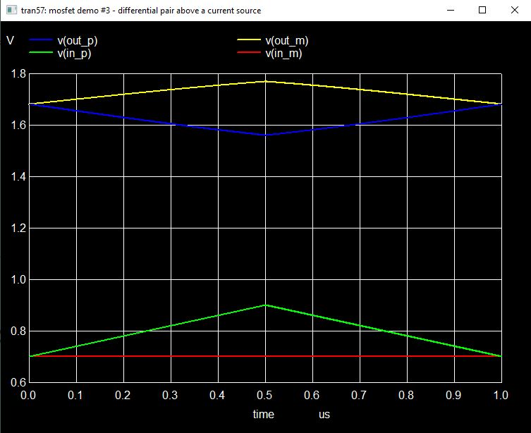
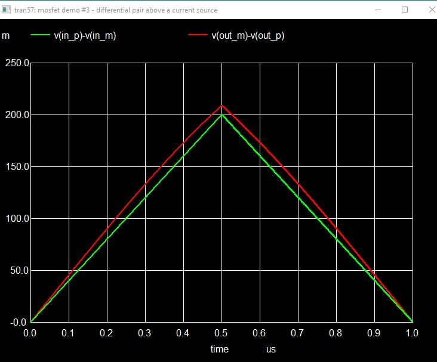
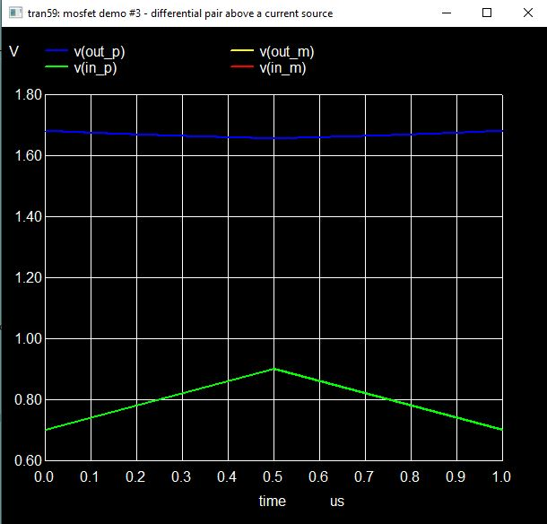

These pictures illustrate the mechanics.

The green and red traces are the inputs to the differential amplifier.
Notice that the plus ramps from 0.7v to 0.9v while the negative stays 
at 0.7v.  So there is a 0.2v differential at the peak of the ramp, but
the inputs are "lopsided" because the plus side of the pair is doing
all the work.

The blue and the yellow traces are the outputs from the differential
amplifier.  Notice that the difference v(out_m)-v(out_p) starts at zero
and gets wider as the difference between the inputs increases.

The most important thing to notice is that the output sides are moving
in opposite directions *symmetrically* even though the inputs were not.
The output is tracking the difference (that's the whole point).

This chart makes it easier to see the difference.  The green trace is 
the difference between the input voltages and the red trace is the 
difference between the output voltages.  You'd never know that the 
inputs were lopsided because it's only the difference that matters.

Here's the proof.  In this test we ramp the plus input and the minus
input in tandem.  The two traces are on top of each other (green).
Notice that the output voltages are *almost* flat across the entire 
test (blue).  This is called common mode rejection.

